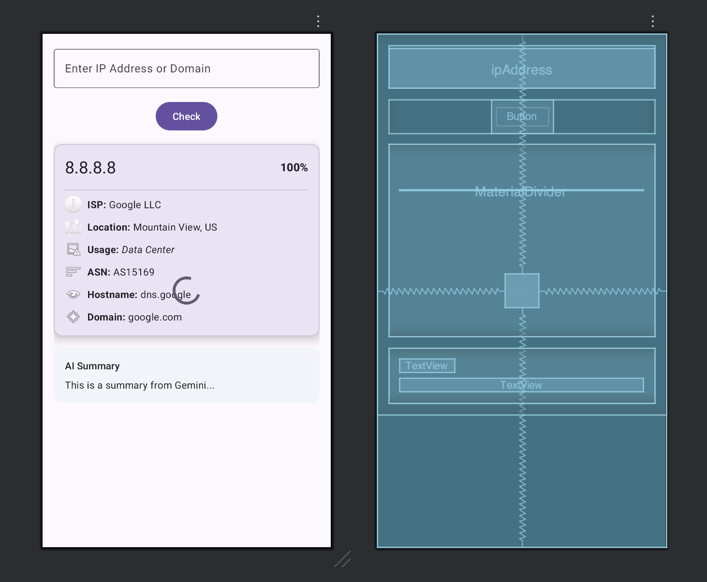

# 🔍 IP & Domain Threat Investigator

An Android tool for analyzing the security reputation of **IP addresses** and **domain names** using [AbuseIPDB](https://www.abuseipdb.com/) and **Gemini AI** for intelligent summarization.

---

## 🧠 Overview

This Android application enables users to quickly check whether an IP address or domain is associated with malicious activity.  
By integrating **AbuseIPDB** and **Google’s Gemini AI**, the app provides both **raw threat data** and a **human-friendly AI summary** of potential risks.

---

## ✨ Key Features

- 🗂 **IP / Domain Input**  
  Enter any IP address or domain name for analysis.

- 🚀 **Instant Threat Check**  
  A single **Check** button triggers the lookup process.

- 🧩 **AbuseIPDB Integration**  
  Fetches detailed threat intelligence including abuse reports, reputation scores, and categories.

- 🤖 **Gemini AI Summary**  
  Automatically generates a concise, AI-driven interpretation of the findings.

- ⏳ **Smooth User Experience**  
  Displays a loading indicator while data is being fetched from external sources.

---

## 📱 UI Structure (activity_main.xml)

| Component | Description |
|------------|-------------|
| **EditText** | Input field for IP or Domain |
| **Button (Check)** | Initiates the lookup |
| **ProgressBar** | Indicates ongoing API request |
| **CardView – AbuseIPDB Details** | Displays raw security report |
| **CardView – AI Summary** | AI-generated readable summary |

---

## ⚙️ Tech Stack

- **Language:** Kotlin / Java  
- **UI Framework:** Android XML Layout  
- **APIs:**  
  - [AbuseIPDB API](https://docs.abuseipdb.com/)  
  - [Gemini AI (Google Generative AI)](https://ai.google.com/gemini/)  
- **Async Handling:** Coroutines / AsyncTasks  
- **JSON Parsing:** Gson / Moshi  

---

## 🧩 Sample Workflow

1. User enters an IP or domain.  
2. Taps **Check** to start.  
3. App displays a progress bar while querying APIs.  
4. **AbuseIPDB results** are displayed in a card.  
5. **Gemini AI summary** interprets the data for a user-friendly output.

---

## 🎨 Screenshots (Optional)

---

## 🧰 Future Enhancements

- 🌐 WHOIS data lookup  
- 📊 Threat trend visualization  
- 🕹 Dark mode support  
- 🔔 Notifications for recurring threats  

---

## 🧾 License

This project is licensed under the **MIT License** – feel free to modify and distribute with attribution.

---

## 💬 Acknowledgments

Special thanks to:  
- [AbuseIPDB](https://www.abuseipdb.com/) for open access to threat intelligence.  
- **Google Gemini AI** for summarization capabilities.  

---

⭐ If you find this useful, consider giving the repository a **star** to support the project!

